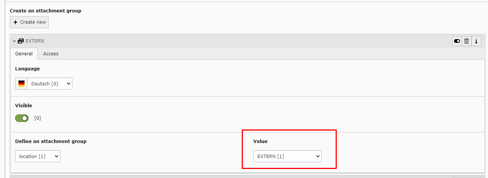

2.0.1 - 2020/06/04
------------------

::

    * 2020-04-06 [Documentation] Changelog information added (Commit: )
    * 2020-04-06 [Version] Version changed to 2.0.1 (Commit: bd09ba5)
    * 2020-04-06 [Documentation] Website Link to automatic importer in introduction page (Commit: bd09ba5)
    * 2020-04-06 [Documentation] Changelog added (Commit: bd09ba5)
    * 2020-04-06 [Refactor] Various functions and database columns added in order to ease the automatic importer  (Commit: bd09ba5)
    * 2020-05-03 [Documentation] Documentation Website added  (Commit: bd09ba5)

===========
TCA Changes
===========

Some TCA changes have been made in order to make the editor's life easier.

The **Attachment group value** has now it is own table in order for the editor to only write the value once and be able to select it via a select dropdown.

The very same thing happens on the **Property type value**

