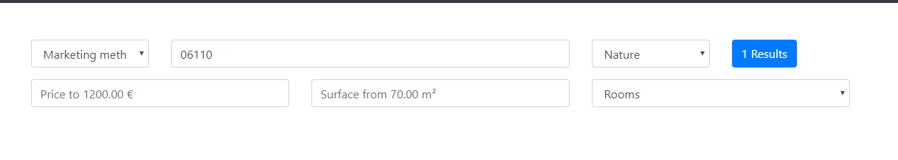
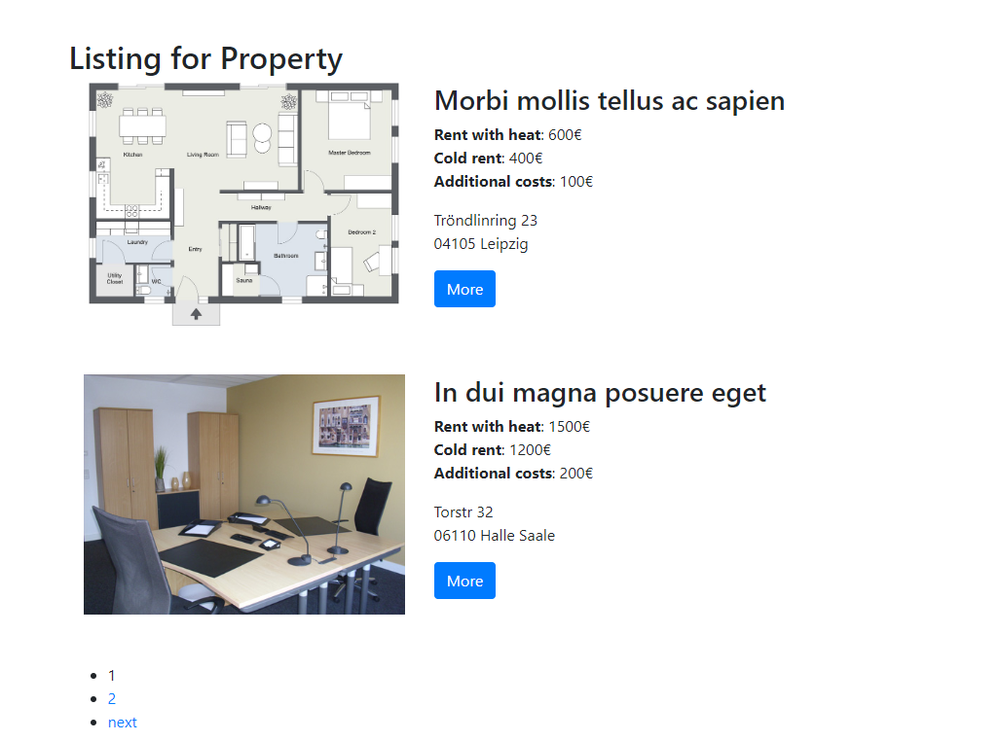
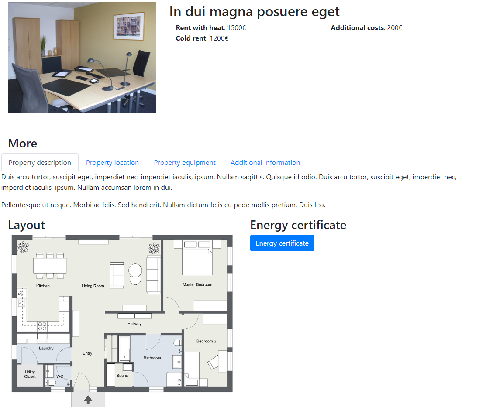
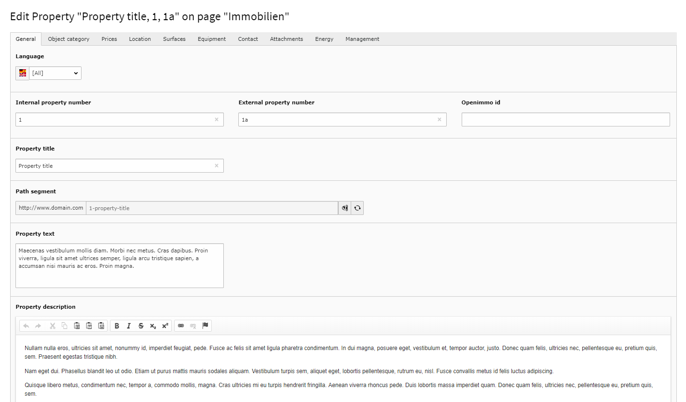
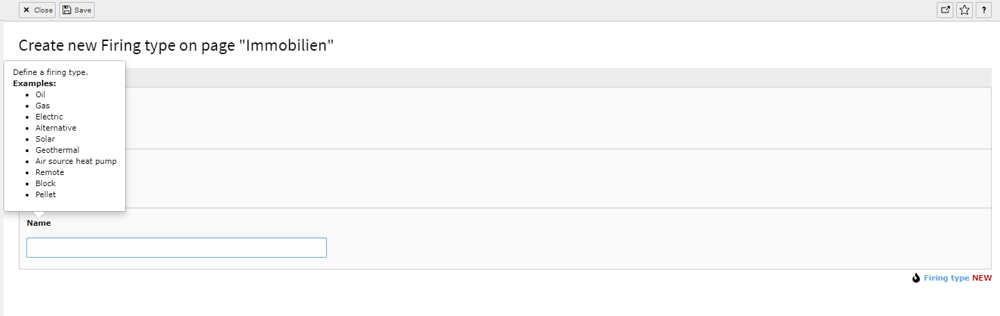
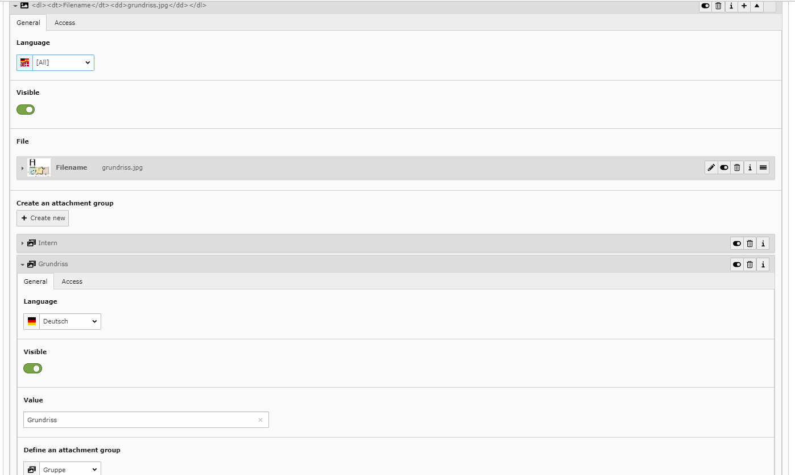
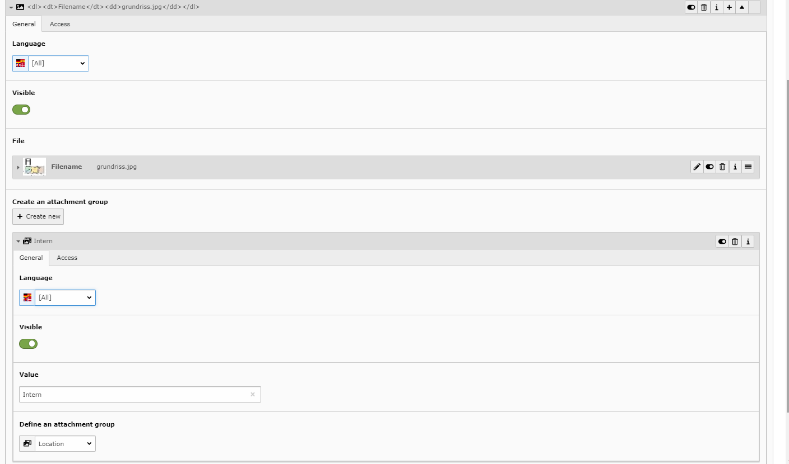

.. include:: ../../Includes.txt

.. _screenshots:

===========
Screenshots
===========

**Ajax search**

**List view**

**Detail view**

**BackEnd**

**Examples**

**Image groups**

The extension uses the OpenImmo structure. OpenImmo defines groups for each image to make the usage of the image easier.
You can name the groups as you like. It makes it easier if you want for example to get the **property layout** and display
it on another section of the page.

Now you can do something like that:

.. code-block:: html

  <f:for each="{property.attachmentsRel}" as="attachment" iteration="iterator">
    <f:for each="{attachment.attachmentGroupValueRel}" as="groupValue">
      <f:if condition="{groupValue.value} == 'Grundriss'">
        <f:image image="{attachment.file}"/>
      </f:if>
    </f:for>
  </f:for>